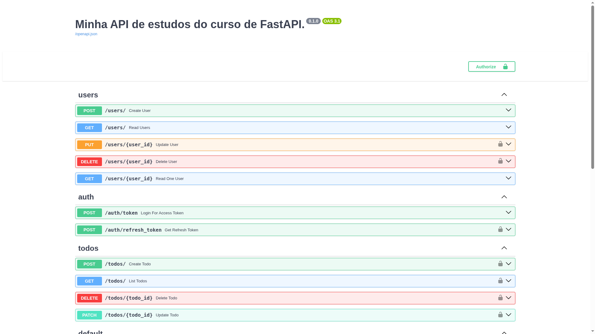

# 📝 Fast Zero - Gerenciador de Tarefas

Este projeto é uma API de gerenciamento de tarefas (Todo List) desenvolvida durante o curso **FastAPI do Zero**, ministrado por [Eduardo Mendes (Dunossauro)](https://github.com/dunossauro). O projeto foca em construir uma aplicação robusta, seguindo as melhores práticas do mercado, testes automatizados e deploy.

---

## 🚧 Progresso do Projeto
**Status:** Em desenvolvimento (Aula 3 de 14) 🚀

- [x] Aula 01: Configuração do ambiente.
- [x] Aula 02: Introdução ao desenvolvimento WEB.
- [x] Aula 03: Estruturando o projeto e criando rotas CRUD.
- [x] Aula 04: Configurando o banco de dados (Alembic).
- [x] Aula 05: Integrando o banco de dados à API
- [ ] Aula 06: Autenticação e Autorização com JWT
- [ ] Aula 07: Refatorando a estrutura do projeto
- [ ] Aula 08: Tornando o projeto assíncrono
- [ ] Aula 09: Tornando o sistema de autenticação robusto
- [ ] Aula 10: Criando rotas CRUD para gerenciamento de tarefas
- [ ] Aula 11: Dockerizando a nossa aplicação e introduzindo o PostgreSQL
- [ ] Aula 12: Automatizando os testes com integração contínua
- [ ] Aula 13: Fazendo o deploy no Fly.io
- [ ] Aula 14: Despedida e próximos passos

---

## 🚀 Tecnologias Utilizadas

O projeto utiliza o que há de mais moderno no ecossistema Python (versões 2025):

* **Python 3.12+**
* **FastAPI** (v0.115+): Framework moderno de alta performance.
* **Pydantic** (v2.0+): Validação de dados e schemas.
* **SQLAlchemy** (v2.0+): ORM para persistência de dados.
* **Alembic**: Gerenciamento de migrações.
* **Pytest**: Testes automatizados.
* **Docker**: Conteinerização.

## 🛠️ Funcionalidades (Previstas e Implementadas)

* **CRUD de Usuários**: Cadastro, atualização e exclusão (Implementando).
* **Autenticação JWT**: Sistema de login seguro.
* **Gerenciador de Tarefas**: CRUD completo de tarefas vinculadas.
* **Assincronismo**: Operações escaláveis com `async/await`.
* **CI/CD**: Integração contínua via GitHub Actions.

## 🔧 Como Executar (Ambiente de Desenvolvimento)

### 1. Clone o repositório
```bash
git clone https://github.com/CaioVHilario/fast_zero.git
cd fast_zero
```
### 2. Configure o ambiente Python
Recomenda-se o uso de ambiente virtual (venv).

```bash


python -m venv .venv
source .venv/bin/activate  # No Linux/Mac
# ou
.venv\Scripts\activate     # No Windows
```

### 3. Instale as dependências
```Bash
pip install -r requirements.txt
```
### 4. Execute o servidor

```bash
fastapi dev fast_zero/app.py
```

Acesse a documentação interativa em: [http://127.0.0.1:8000/docs](http://127.0.0.1:8000/docs)



## 🧪 Rodando Testes
Para garantir que tudo está funcionando corretamente:

```Bash
pytest -v
```

### 📚 Créditos e Referências
Este projeto é baseado no curso gratuito de FastAPI do Zero da [Live de Python](https://github.com/dunossauro/fastapi-do-zero).

Licença do Material: Creative Commons BY-NC-SA.

Desenvolvido por Caio Vieira Hilário


